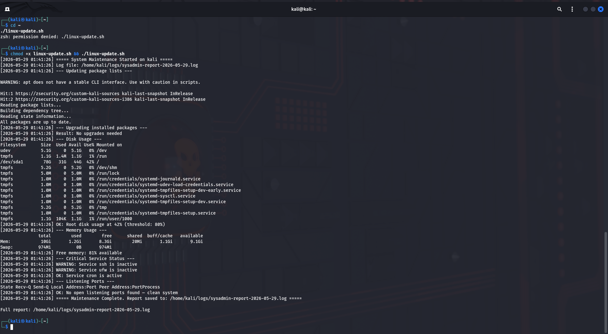

# 🛠️ Infrastructure Engineer Home Lab

Hands-on hybrid infrastructure lab demonstrating real sysadmin,
cloud, and security skills on Windows 11 and Kali Linux using VMware.

---

## Lab Environment

| System | Platform | Purpose |
|---|---|---|
| Kali Linux VM | VMware | Patch management, service monitoring, port auditing |
| Windows 11 (Host) | Physical | PowerShell automation, patch auditing, Defender monitoring |

---

## Prerequisites

| System | Requirement |
|---|---|
| Kali Linux VM | Bash, `sudo` access, internet access for `apt` |
| Windows 11 | PowerShell 5.1+, run as **Administrator** |

---

## Scripts

### linux-update.sh (Bash)
Automated Linux maintenance script that:
- Updates and upgrades all packages
- Checks disk usage and warns above 80% threshold
- Monitors critical services (SSH, UFW, Cron)
- Audits open listening ports
- Saves dated log report to ~/logs/

### windows-patch.ps1 (PowerShell)
Windows health and patch audit script that:
- Lists all patches installed in last 30 days
- Monitors critical services (Windows Update, Defender, DNS, EventLog, Windows Time)
- Checks disk usage on all drives and warns above 80%
- Verifies Windows Defender status and signature freshness
- Saves dated report to Documents folder

---

## How to Run

### Linux (Kali)

```bash
git clone https://github.com/AMANNANDA1/infrastructure-engineer-homelab.git
cd infrastructure-engineer-homelab/scripts
chmod +x linux-update.sh
sudo ./linux-update.sh
```

The report is saved to `~/logs/`. If you get `permission denied`, the script is missing its execute bit, so run the `chmod +x` line. See [docs/troubleshooting.md](docs/troubleshooting.md).

### Windows 11

Open PowerShell **as Administrator**, then:

```powershell
cd path\to\infrastructure-engineer-homelab\scripts
Set-ExecutionPolicy -Scope Process -ExecutionPolicy Bypass
.\windows-patch.ps1
```

The report is saved to `Documents\patch-report-<date>.txt`. The execution policy change applies to the current session only.

---

## Real Findings from Lab

| Finding | System | Status | Action Taken |
|---|---|---|---|
| SSH service inactive | Kali Linux | Fixed | Started with systemctl, enabled on boot |
| UFW not installed | Kali Linux | Fixed | Installed and enabled ufw |
| UFW systemctl bug | Kali Linux | Documented | UFW uses SysV not systemd on Kali — verified with ufw status instead |
| W32Time stopped | Windows 11 | Noted | Non-critical on standalone machine |
| Port 22 open | Kali Linux | Expected | SSH enabled intentionally for remote management |
| 3 KB patches installed | Windows 11 | Healthy | KB5092427, KB5092762, KB5089549 applied |
| Defender signatures | Windows 11 | Healthy | 0 days old — fully up to date |

---

## Troubleshooting

See [docs/troubleshooting.md](docs/troubleshooting.md) for full debug log including:
- Permission denied fix for /var/log/ on Kali
- UFW systemd vs SysV behaviour on Kali Linux

---

## Screenshots

### Linux — Initial Run (Permission Denied Bug)


### Windows — Script in PowerShell


### Windows — Patch & Health Report


### Linux — Final Run (Updates, Services, Open Ports)


---

## Skills Demonstrated

- Linux & Windows system administration
- Bash and PowerShell scripting
- Security auditing and remediation (SSH, UFW, Defender)
- Patch management and compliance checking
- Service monitoring and alerting
- Debug and troubleshooting documentation
- VMware virtualization (Kali Linux + Windows 11)
